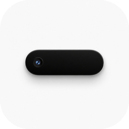

  

<h1 align="center">GlancePanel</h1>

  MacBook notch utility — screenshots, now playing, and notes in one hover.

  <a href="download/GlancePanel-1.0.0.zip"><strong>Download</strong></a>

## In action

Hover the island under the notch — the panel opens with your recent screenshots, media controls, and notes.

  

  <a href="assets/demo.mp4"><strong>Full demo (mp4)</strong></a>

## Requirements

- MacBook with notch (Apple Silicon)
- macOS 14.6 or later

The build in this repo is **Developer ID signed** and **notarized by Apple**.

## Install

1. Download [`GlancePanel-1.0.0.zip`](download/GlancePanel-1.0.0.zip)
2. Unzip and move `GlancePanel.app` to Applications
3. Open the app and hover the top-center capsule under the notch

## License

Copyright © 2026 GlancePanel. All rights reserved.  
Developed by <a href="https://however-digital.tech" target="_blank" rel="noopener noreferrer">however-digital.tech</a>.
