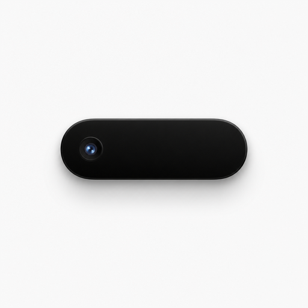
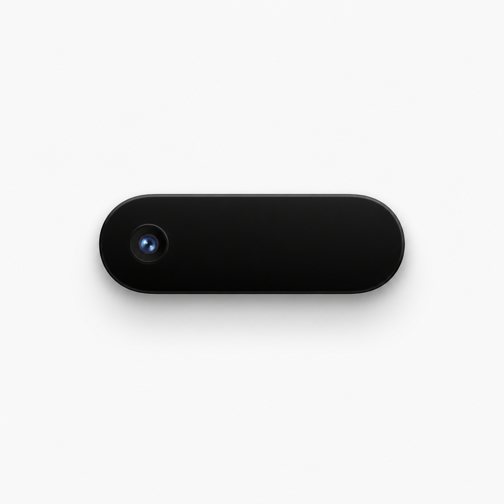

<p align="center">
  
</p>

<h1 align="center">GlancePanel</h1>

<p align="center">
  MacBook notch utility — screenshots, now playing, and notes in one hover.
</p>

<p align="center">
  <a href="https://ilyagaltsev.github.io/glance-panel-preview/"><strong>Landing page</strong></a>
  ·
  <a href="download/GlancePanel-1.0.0.zip"><strong>Download 1.0.0</strong></a>
  ·
  <a href="https://however-digital.tech">however-digital.tech</a>
</p>

---

<p align="center">
  
</p>

## What it is

GlancePanel turns the MacBook notch into a Dynamic Island–style capsule. Hover it to open a panel with:

| Module | What you get |
| --- | --- |
| **Screenshots** | Recent captures — drag into Slack, Mail, Finder, or a browser |
| **Playing** | Now playing controls for Music, Spotify, and browser media |
| **Notes** | Quick notes and secret notes (masked, copy on click) |

Also: launch at login, optional menu bar icon, show delay, haptic feedback.

<p align="center">
  
</p>

## Requirements

- MacBook with notch (Apple Silicon)
- macOS 14.6 or later

The build in this repo is **Developer ID signed** and **notarized by Apple**.

## Install

1. Download [`GlancePanel-1.0.0.zip`](download/GlancePanel-1.0.0.zip)
2. Unzip and move `GlancePanel.app` to Applications
3. Open the app and hover the top-center capsule under the notch

## This repository

Static landing site for [GitHub Pages](https://ilyagaltsev.github.io/glance-panel-preview/):

```text
index.html      marketing page
styles.css      layout & motion
script.js       interactive notch demo
assets/         icon, hero, island art
download/       notarized app zip
```

### Local preview

```bash
python3 -m http.server 8765
```

Open [http://127.0.0.1:8765](http://127.0.0.1:8765).

## License

Copyright © 2026 GlancePanel. All rights reserved.  
Developed by [however-digital.tech](https://however-digital.tech).
